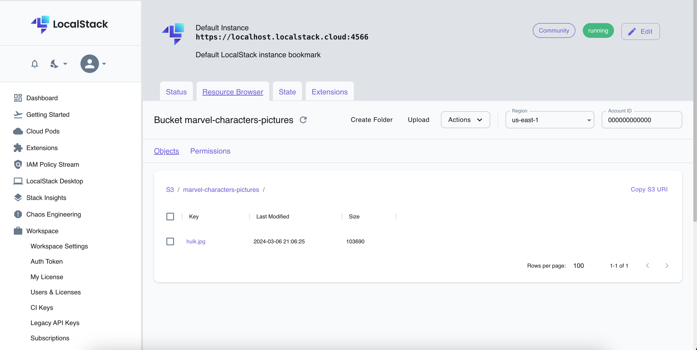

# Getting Started


### Reference Documentation

Step by step to use this application:

1. Download and install Docker
2. Download and install aws-cli and aws-local


3. Access the project folder Kualit-Marvel and run the command below to up the localstack service by Docker:
```yml
docker-compose up -d
```
4. Run these commands to create a new user to access localstack

```yml
 aws configure --profile localstck set aws_access_key_id test
 aws configure --profile localstack set aws_secret_access_key test
```
5. Run this command to create a client-credentials in the aws-secret-manager:
   Change the values MARVEL_PUBLIC_KEY and MARVEL_PRIVATE_KEY for your Marvel's api credentials.
   You can create credentials to the Marvel API on the official website:
   https://developer.marvel.com/

```yml
awslocal secretsmanager create-secret --name /secret/client-credentials  --secret-string "{\"client-marvel-public-key\":\"MARVEL_PUBLIC_KEY\", \"client-marvel-private-key\":\"MARVEL_PRIVATE_KEY\"}"
```

6. Run these commands to create a sns topic, create a sqs queue and create a subscription from this queue to sns:

```yml
awslocal sns create-topic --name character-picture-topic
awslocal sqs create-queue --queue-name character-picture-queue
awslocal sns subscribe  --region us-east-1 --topic-arn arn:aws:sns:us-east-1:000000000000:character-picture-topic --protocol sqs --notification-endpoint arn:aws:sqs:us-east-1:000000000000:character-picture-queue
```

7. Run this command to create a S3 Bucket:

```yml
awslocal s3 mb s3://marvel-characters-pictures
```
8. Run the projects API and S3 Worker
9. Execute this call by Postman:

```yml
curl --location 'localhost:8083/api/v1/marvelcharacter/hulk'
```


The image was created into the bucket:



